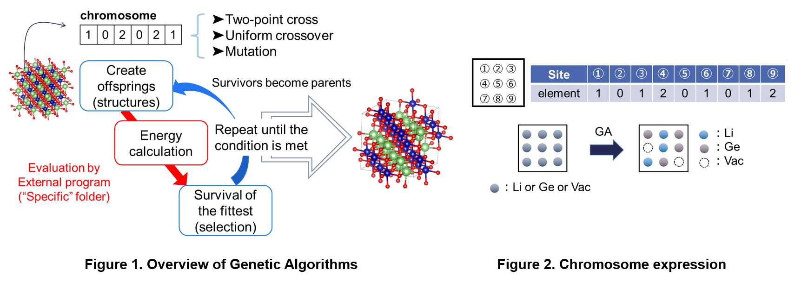

# Genetic Algolithm for mAterial (GmAte.py)

Authors: Yumika YOKOYAMA, Tsubasa KOYAMA, Masanobu NAKAYAMA (Nagoya Institute of Technology)

## Change log
Aug. 2024   v1.0.0 
Feb. 2025   v2.0.0  Add GAML feature 

## Purpose
A program designed to optimize the atomic arrangement for partially substituted sites in given host structure, mainly for inorganic crystalline materials. In defective or nonstoichiometric compounds, the stability of the system can vary depending on the arrangement of atoms or defects. This program uses a genetic algorithm to search for the most stable arrangement by reducing the total energy of the system. Additionally, it can be applied to systems beyond crystalline inorganic solid materials if appropriate input is provided. Moreover, the target properties for optimization can include factors other than the system's energy.   
When evaluating inorganic structures with substituted elements, it is crucial to determine which site’s atoms to substitute. In most cases, the most stable structure is used, but the number of possible arrangements often cause a combinatorial explosion, making it nearly impossible to compute all possibilities due to computational costs. This script utilizes the genetic algorithm (GA), an optimization algorithm, to discover the most stable structure with fewer search iterations.

## Technical background
The following passage introduces a process for generating atomic arrangements in partially occupied sites using a Genetic Algorithm (GA) to find the most stable energy configuration.

Figure 1 shows the flow of the genetic algorithm. In the genetic algorithm, optimization is advanced using chromosomes that represent the arrangement of atoms. As shown in Figure 2, the chromosome is a sequence of number labels (0, 1, 2...).  The numbers in the label correspond to the atomic species specified by the user and are arranged in the order of the site numbers designated by the user. By determining the chromosome, you can define a structure that indicates the specific arrangement of atoms.
First, several randomly arranged structures are created (first generation), and their energy values are evaluated (red part in Figure 1). In GmAte.py requires external software to evaluate energies for GA-generated structures (Red part in Figure 1). Energetically stable structures are selected as survivors (three algorithm are implemented in GmAte.py, (1) Ranking-, (2) Tournament-, and (3) Roulette-selection algorithms as mentioned later).  Survivors (paretents) chromosome are succeeded to the next generation through the following four processes:

1) The most stable structures are inherited directly.
2) Chromosomes are created by two-point crossover.
3) Chromosomes are created by uniform crossover.
4) Chromosomes are created by mutation. 

Thus generated new chromosomes (offsprings) are again evaluated their energies using external software, and selected new survivors.  This routine repeats until the user-set stopping criteria are met.

Current version include script for evaluation of energies using [M3GNet.py](https://github.com/materialsvirtuallab/m3gnet).

**About GAML**
Additionally, to address the issue of slow convergence when there are many GA genes, this program can execute "GAML". GAML aims to discover the most stable structure with fewer generations by incorporating machine learning (ML) into the selection process.
In GAML, all structures generated in past GA generations are converted into descriptors, and ML regression analysis is applied to their energy values obtained from material simulations to create a prediction function. When the prediction accuracy exceeds a user-defined threshold, more individuals than the required number n for the next generation are generated through genetic operations. These excess individuals are then evaluated using ML predictions, and the candidates with higher predicted fitness are selected and combined with the individuals created using the conventional GA method to form the population for the next generation. Furthermore, by updating the prediction function in each generation, the convergence of the GA can be accelerated iteratively.

GAML consists of six steps, including the four previously mentioned steps and the following two additional steps:
5) Generate multiple genes through crossover and perform prediction using machine learning.
6) Generate multiple genes through mutation and perform prediction using machine learning.

## Usage
**Preparation of Files**
1. Necesarry files  
    * Specific  
        ├POSCAR_org  
        ├inp_POSCAR.py  
        ├optm3g.py (optional: when thread=True, runtype="m3g" in inp_POSCAR.py.  M3GNet calculations are applied for energy evaluations of given individuals )  
        └calc_energy.py (optional: when thread=False in inp_POSCAR.py)     
    * inp_ga.py  
    * inp.params  
    * prepstrings.py 
    * SpccificML（Option: Used when mlga=True in inp_ga.py. Required only when executing GAML）
        ├ make_model.py（Code to create a machine learning model using Random Forest）
        └ predML.py（Code to perform predictions using a machine learning model）
    
    inp_ga.py, inp.params, POSCAR_org, inp_POSCAR.py are required to edit

2. Preparation of "POSCAR_org" file
    Create a POSCAR file (Structure format for VASP) and change the label of the site you want to optimize to ELEM1. If there are plural sites to be optimized, label them as ELEM2, ELEM3, and so on.

3. Preparation of "inp_POSCAR.py" file
    

    Table1. examples of input parameters in inp_POSCAR.py
    
  
    
    | parametars | example | memo |
    |----|----|----| 
    | runtype | "m3g" | Input the code to evaluate the energy (or the other target variables) of the structures generated from the genetic algorithm. Example is use of the neural network potential, M3GNet|
    | ions | ["Li", "Al", "O"] | Input the element symbols (or labels) for all constituent atoms in string format. Use Python array format. |
    | ELEM | [["Li", "Al"]] | candidate element symbols which occupies the specific site (ELEM1, ELEM2... sites) by python list format [[Atoms at ELEM1], [Atoms at ELEM2], ...]  |
    | savefiles |  ["POSCAR", "CONTCAR", "temp_gene"] | File names for structure input, optimized structure after the evaluation, tempral output file of gene string |
    | output | "energy" | Filename where the evaluation values of the structures generated by the GA are stored. In the case shown in the example, the evaluation values are output as text in a file named 'energy.' | 
    | thread | True | Set this to True if you want to perform evaluation calculations for individuals by importing an external file. If set to False, the script will start calc_energy.py for each calculation. |  
    
    By setting thread = True, instead launching external program for evaluation of GA generated individuals, imports python evaluation scheme (currently M3GNet only).  Thus, the number of Python imports can be reduced, potentially shortening computation time.
    Example:
        If thread = True and runtype = m3g, the optm3g.py file in the "Specific" directory will be read to perform structure relaxation using M3GNet.
        If thread = False, a separate Python file for M3GNet execution is required, and modules will be imported with each computation, potentially increasing computation time.

4. Preparation of "inp_ga.py" file  
    This input file is for Setting GA scheme  
    

    Table2. list of input tags for inp_ga.py   
    
  
    
    | input tags | default | memo |
    |----|----|----| 
    | POPULATION | 24 | number of individuals at each generation |
    | NUM_OF_STRINGS | 1 | number of chromosome (ELEM1-ELEMn should be assigned in POSCAR_org, if NUM_OF_STRINGS=n) |
    | MAX_GENERATION | 300 | Maximum number of generation |
    | SAVE | 3 | The number of the best individuals to carry over to the next generation without any chromosome modifications |
    | SURIVAL_RATE | 0.6 | The number of survivors in the current generation. These individuals will serve as the parents for the offspring in the next generation.|
    | CR_2PT_RATE | 0.4 | The rate of two-point crossover|
    | CR_UNI_RATE | 0.4 | The rate of homogeneous crossover |
    | CR_UNI_PB | 0.5 | The probability that a flip is allowed in the components (bases) of the chromosomes selected by homogeneous crossover.  |
    | MUTATION_PB | 0.02 | The rate of mutation |
    | STOP_CRITERIA | 100 | Stopping criteria. GmAte.py will be stopped after STOP_CRITERIA generations without updating the best chromosome. |
    | RESTART | True | f you want to restart the calculation from where it left off, set this option to True. However, you will need the out.value_indiv file to continue. If you want to start from the first generation, set it to False. |
    | ELEMENT_FIX | True | Set to True if you want to fix the number of each element. |
    | select_mode | "ranking" | algorithm which selects suvivors among three options as below.      (1) ranking: Individuals are sorted by energy stability, and the top ones are selected as survivors.  (2) tournament: A tournament is held, and the winners are selected as survivors.   (3)roulett: Individuals are weighted based on their ranking, and survivors are selected by spinning a roulette. The better the individual, the more likely they are to be selected by the roulette. 
    | temp_gene | "temp_gene" | |
    | eval_file | "energy" | file name that contains evaluation scores |
    | ncore | 8 | The number of relaxation calculations executed concurrently |

 
5. Preparation of "inp.params" file

    A file for defining genes. It specifies how many components (0, 1, 2...) are present.
    
    (Appendix) Preparation of inp.params using the attached program.
    1) Edit prepstrnigs.py  
        0, 1, 2...The label number in chromosomes corresponds to the order set by ELEM in "inp_POSCAR.py".  
    2) Execute prepstrings.py 
        Creating inp.parmas

&nbsp; 
**Structure relaxation (evaluation process)**    
* by VASP (https://www.vasp.at/)
  - Set tags in inp_POSCAR.py as below,
      runtype = "vasp"  
      thread = False  
  - Prepare following VASP input files in "Specific" folder  
      KPOINTS, INCAR, POTCAR
      If POSCAR is required for POTCAR creation, you can create the POSCAR by copying inp.params to temp_gene and running 「./calc_energy.py -gene2pos」

* by M3GNet   (https://github.com/materialsvirtuallab/m3gnet )
  - Set tags in inp_POSCAR.py as below  
    runtype = "m3g"  
    thread = True   
  - Copy optm3g.py in "Specific" folder  

**Execute GA**  
* $python GmAte.py -ga  
    for optimization of element arrangement  
&nbsp;  
* $python GmAte.py -bestgene out.value_indiv (Arg1) (Arg2)  
    After the GA optiization is completed, extract GA selected POSCAR files from the top (Arg1)th to (Arg2)th and save POSCAR files in a directory for each
&nbsp;
* $python calc_energy.py -gene2pos   
    When executed in a directory containing temp_gene, POSCAR_org, and inp_POSCAR.py, the program reads the chromosomes from temp_gene (inp.params formatted) and generates POSCAR files.
    The chromosome sequences are saved in Save_info and out.value_indiv. 
&nbsp;      

##　Selection Method for Surviving Individuals
The selection method for surviving individuals can be specified around line 38 in GmAte_ML.py.
select_mode = "ranking"

* Ranking Selection (ranking)
    The same selection method as gstring. Individuals are ranked in order of energy stability, and the top individuals are selected for survival.

* Tournament Selection (tournament)
    A tournament is conducted, and the winners are selected as surviving individuals.

* Roulette Selection (roulett)
    Weights are assigned based on fitness, and a roulette wheel is spun to select surviving individuals. More fit individuals have a higher probability of being chosen.
&nbsp;   

## About an example folder   
* LSCF_M3GNet  
   This refers to the optimization of the (La, Sr) sites and (Co, Fe) sites in La38Sr26Co13Fe51O192.  
   Calculations are performed using M3GNet by running `m3g.py` through `calc_energy.py`.  
   *Note: Currently, `m3g.py` is not available on Github.  
   The numbers of La, Sr, Co, and Fe are fixed.
&nbsp;      
* LSCF_nofix_M3GNet  
   This refers to the optimization of the (La, Sr) sites and (Co, Fe) sites in (La, Sr)64(Co, Fe)64O192.  
   Calculations are performed using M3GNet.  
   The ratios of (La, Sr) and (Co, Fe) are not fixed.
&nbsp;
* LiAlO2_import_M3GNet  
   This refers to the optimization of the cation sites in LiAlO2.  
   Calculations are performed using M3GNet with Specific/optm3g.py.  
   The computation is faster because the import process is done only once.
&nbsp;
* LiCoO2_GAML
    Optimization of cation sites in LiCoO2 using GAML.
    Some genes are introduced through machine learning predictions using Random Forest.
&nbsp;
* LaSrGa3O7_GAML
    Optimization of La/Sr sites in La1.5Sr0.5Ga3O7.25 using GAML.
    Some genes are introduced through machine learning predictions using Random Forest.

## License, Citing
**About License**  
This software is released under the MIT License, see the LICENSE.  
**Citing**  
M. Nakayama, K. Nishii, K. Watanabe, N. Tanibata, H. Takeda, T. Itoh, T. Asaka, "First-principles study of the morphology and surface structure of LaCoO3 and La0.5Sr0.5Fe0.5Co0.5O3 perovskites as air electrodes for solid oxide fuel cells", Sci. Technol. Adv. Mater.: Methods, 1, 24-33 (2021)  [DOI:10.1080/27660400.2021.1909871 ](https://doi.org/10.1080/27660400.2021.1909871)

## Funding
Grants-in-Aid for Scientific Research (nos. 19H05815, 20H02436), MEXT, Japan

    

