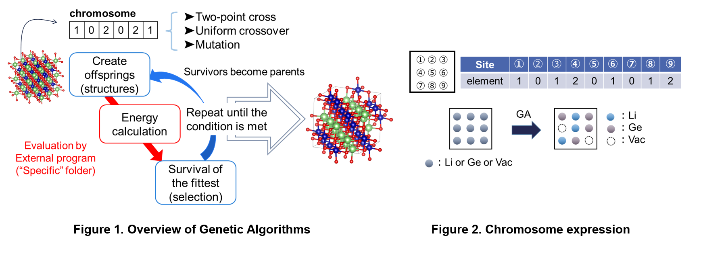

# Genetic Algolithm for mAterial (GmAte.py)

Authors: Yumika YOKOYAMA, Tsubasa KOYAMA, Masanobu NAKAYAMA (Nagoya Institute of Technology)

## Change log
Aug. 2024   First edition by Yumika YOKOYAMA (v1.0.0) <br>
Feb. 2025   Add GAML feature by Tsubasa KOYAMA and Yumika YOKOYAMA (v2.0.0) <br>
May. 2026   Update calc_engine plugin interface (v2.1.0) <br>

## Purpose
A program designed to optimize the atomic arrangement for partially substituted sites in given host structure, mainly for inorganic crystalline materials. In defective or nonstoichiometric compounds, the stability of the system can vary depending on the arrangement of atoms or defects. This program uses a genetic algorithm to search for the most stable arrangement by reducing the total energy of the system. Additionally, it can be applied to systems beyond crystalline inorganic solid materials if appropriate input is provided. Moreover, the target properties for optimization can include factors other than the system's energy.   
When evaluating inorganic structures with substituted elements, it is crucial to determine which site’s atoms to substitute. In most cases, the most stable structure is used, but the number of possible arrangements often cause a combinatorial explosion, making it nearly impossible to compute all possibilities due to computational costs. This script utilizes the genetic algorithm (GA), an optimization algorithm, to discover the most stable structure with fewer search iterations.

## Technical background
The following passage introduces a process for generating atomic arrangements in partially occupied sites using a Genetic Algorithm (GA) to find the most stable energy configuration.

Figure 1 shows the flow of the genetic algorithm. In the genetic algorithm, optimization is advanced using chromosomes that represent the arrangement of atoms. As shown in Figure 2, the chromosome is a sequence of number labels (0, 1, 2...).  The numbers in the label correspond to the atomic species specified by the user and are arranged in the order of the site numbers designated by the user. By determining the chromosome, you can define a structure that indicates the specific arrangement of atoms.
First, several randomly arranged structures are created (first generation), and their energy values are evaluated (red part in Figure 1). In GmAte.py requires external software to evaluate energies for GA-generated structures (Red part in Figure 1). Energetically stable structures are selected as survivors (three algorithm are implemented in GmAte.py, (1) Ranking-, (2) Tournament-, and (3) Roulette-selection algorithms as mentioned later).  Survivors (paretents) chromosome are succeeded to the next generation through the following four processes:

1) The most stable structures are inherited directly.
2) Chromosomes are created by two-point crossover.
3) Chromosomes are created by uniform crossover.
4) Chromosomes are created by mutation. 

Thus generated new chromosomes (offsprings) are again evaluated their energies using external software, and selected new survivors.  This routine repeats until the user-set stopping criteria are met.

Current version include script for evaluation of energies using [M3GNet.py](https://github.com/materialsvirtuallab/m3gnet).

**About GAML**
Additionally, to address the issue of slow convergence when there are many GA genes, this program can execute "GAML". GAML aims to discover the most stable structure with fewer generations by incorporating machine learning (ML) into the selection process.
In GAML, all structures generated in past GA generations are converted into descriptors, and ML regression analysis is applied to their energy values obtained from material simulations to create a prediction function. When the prediction accuracy exceeds a user-defined threshold, more individuals than the required number n for the next generation are generated through genetic operations. These excess individuals are then evaluated using ML predictions, and the candidates with higher predicted fitness are selected and combined with the individuals created using the conventional GA method to form the population for the next generation. Furthermore, by updating the prediction function in each generation, the convergence of the GA can be accelerated iteratively.

GAML consists of six steps, including the four previously mentioned steps and the following two additional steps:
5) Generate multiple genes through crossover and perform prediction using machine learning.
6) Generate multiple genes through mutation and perform prediction using machine learning.

**GAML ML engine interface** (`SpecificML/ml_engine.py`)

GmAte.py calls the ML engine via two in-memory functions — no intermediate files are written:

```python
# Train a model on all evaluated individuals in the current generation.
model, rmse = ml_engine.train(genes, energies)
# genes     : list of gene-string lists [[str, ...], ...]
# energies  : list of float (corresponding evaluation values)
# Returns   : (trained model object, cross-validation RMSE)

# Rank candidate genes by predicted evaluation value (ascending).
sorted_indices = ml_engine.predict(model, candidate_genes)
# candidate_genes : list of gene-string lists
# Returns         : list of int — indices into candidate_genes, best first
```

The default `ml_engine.py` uses Random Forest regression with RDF (Radial Distribution Function) descriptors computed by ASE.  To use a different ML model or descriptor, copy `SpecificML/ml_engine.py` and implement the two functions above.




## Directory Structure

```
GA-for-material/
├── GmAte.py
├── inp_ga.py
├── inp.params
├── Specific/               ← engine-specific files
│   ├── inp_POSCAR.py       ← specifies which calc_engine file to use
│   ├── calc_engine_mace.py ← your calculation engine (copy from example/)
│   ├── POSCAR_org
│   ├── INCAR               ← VASP only
│   ├── KPOINTS             ← VASP only
│   └── POTCAR              ← VASP only
└── example/
    ├── Specific_mace/      ← MACE template
    ├── Specific_vasp/      ← VASP template (includes sample INCAR, KPOINTS)
    ├── Specific_m3gnet/    ← M3GNet template
    ├── Specific_chgnet/    ← CHGNet template
    └── Specific_matlantis/ ← Matlantis/LightPFP template
```

## Usage
**Preparation of Files**
1. Necessary files  
    * Specific/  
        ├ POSCAR_org  
        ├ inp_POSCAR.py  
        └ calc_engine_***.py  ← **copy from example/Specific_***/ and implement**  
    * inp_ga.py  
    * inp.params  
    * prepstrings.py  
    * SpecificML/ (Option: used when mlga=True in inp_ga.py)
        └ ml_engine.py  ← standard ML interface (train / predict in memory)

2. Preparation of "POSCAR_org" file
    Create a POSCAR file (VASP5 format) and replace the element label of each
    site to optimize with ELEM1. For multiple groups use ELEM2, ELEM3, etc.

3. Preparation of "Specific/calc_engine_***.py" (calculation engine plugin)

    GmAte.py loads the engine file specified in `Specific/inp_POSCAR.py` and calls:

    ```python
    score = calc_engine.run(work_dir)
    ```

    **Standard interface** — implement exactly this function:

    ```python
    def run(work_dir: str) -> float:
        """
        Parameters
        ----------
        work_dir : str
            Working directory for this individual.
            GmAte writes the following files here before calling run():
              POSCAR    -- structure in VASP5 format
              temp_gene -- gene string (see format below)
        Returns
        -------
        float
            Evaluation value (energy etc., lower = more stable).
        """
    ```

    **temp_gene format** — the only input your engine needs to know about:

    ```
    # One line per ELEM group (NUM_OF_STRINGS lines total).
    # Characters are integer indices: 0, 1, 2, ... mapping to ELEM in inp_POSCAR.py.
    #
    # Example: ELEM = [["Li", "Al"]]
    #   temp_gene:  00110011
    #   site order: Li Li Al Al Li Li Al Al
    #
    # Example: ELEM = [["Li", "Al"], ["Co", "Fe"]]
    #   temp_gene line 1:  00110011   ← ELEM1 (Li/Al sites)
    #   temp_gene line 2:  01010101   ← ELEM2 (Co/Fe sites)
    ```

    Copy a ready-made template from `example/` and edit it:

    | Template folder | Engine |
    |---|---|
    | `example/Specific_mace/` | MACE (ASE-based universal NNP) |
    | `example/Specific_m3gnet/` | M3GNet (wraps Specific/optm3g.py) |
    | `example/Specific_chgnet/` | CHGNet (Materials Project universal NNP) |
    | `example/Specific_matlantis/` | Matlantis / LightPFP |
    | `example/Specific_vasp/` | VASP (first-principles, HPC/cluster) |

4. Preparation of "Specific/inp_POSCAR.py"

    | parameter | example | memo |
    |---|---|---|
    | calc_engine | "calc_engine_mace.py" | Engine file name in Specific/ |
    | ions | ["Li", "Al", "O"] | All element symbols in the structure |
    | ELEM | [["Li", "Al"]] | Candidate elements per ELEM group: [[ELEM1], [ELEM2], ...] |
    | savefiles | ["POSCAR", "CONTCAR", "temp_gene"] | Files to archive after each evaluation |
    | output | "energy" | Energy file name written by the engine (for archiving) |

5. Preparation of "inp_ga.py"

    | parameter | default | memo |
    |---|---|---|
    | mlga | False | Set True to enable GAML |
    | save_ml_log | True | Write training RMSE (`test_rmse.out`) and selected gene strings (`sort_label.out`); set False for memory-only mode |
    | POPULATION | 24 | Individuals per generation |
    | NUM_OF_STRINGS | 1 | Number of chromosome groups (= number of ELEM groups) |
    | MAX_GENERATION | 300 | Maximum generations |
    | SAVE | 3 | Elite individuals carried over unchanged |
    | SURVIVAL_RATE | 0.6 | Fraction of individuals selected as parents |
    | CR_2PT_RATE | 0.4 | Two-point crossover rate |
    | CR_UNI_RATE | 0.4 | Uniform crossover rate |
    | CR_UNI_PB | 0.5 | Flip probability in uniform crossover |
    | MUTATION_PB | 0.02 | Mutation probability per gene |
    | STOP_CRITERIA | 100 | Stop after this many generations without improvement |
    | RESTART | False | Resume from out.value_indiv if True |
    | ELEMENT_FIX | True | Fix element counts (True = composition conserved) |
    | select_mode | "ranking" | Survivor selection: "ranking", "tournament", or "roulet" |
    | temp_gene | "temp_gene" | Gene file name |
    | n_parallel | 6 | **Concurrent calculation processes.** Resource management per process is handled inside calc_engine.py. Guidelines: <br>• Python NNP (MACE, CHGNet): set `torch.set_num_threads(1)` inside run(); n_parallel = CPU cores (or GPUs) <br>• VASP / external binary: n_parallel = 1 recommended; parallelism via MPI inside VASP_CMD <br>• HPC cluster: total cores = n_parallel × (cores per VASP job) |

6. Preparation of "inp.params"

    Defines the gene alphabet. Created by prepstrings.py.
    1) Edit prepstrings.py (indices 0, 1, 2... match ELEM order in inp_POSCAR.py)
    2) Run `python prepstrings.py` → generates inp.params

&nbsp;
**Quick-start: connecting your engine**

* **MACE**
  ```
  cp example/Specific_mace/* Specific/
  # edit Specific/inp_POSCAR.py and Specific/calc_engine_mace.py
  pip install mace-torch
  ```

* **CHGNet**
  ```
  cp example/Specific_chgnet/* Specific/
  pip install chgnet
  ```

* **M3GNet**
  ```
  cp example/Specific_m3gnet/* Specific/
  pip install matgl          # recommended (newer)
  # or: pip install m3gnet   # legacy
  ```

* **VASP**
  ```
  cp example/Specific_vasp/* Specific/
  # place POTCAR in Specific/, edit VASP_CMD in calc_engine_vasp.py
  ```

* **Matlantis / LightPFP**
  ```
  cp example/Specific_matlantis/* Specific/
  # set n_parallel = 1 in inp_ga.py
  pip install pfp-api-client matlantis-pfp
  ```

**Execute GA**  
* $python GmAte.py -ga  
    for optimization of element arrangement  
&nbsp;  
* $python GmAte.py -bestgene out.value_indiv (Arg1) (Arg2)  
    After the GA optiization is completed, extract GA selected POSCAR files from the top (Arg1)th to (Arg2)th and save POSCAR files in a directory for each   
&nbsp;   
* $python GmAte.py -gene2pos (Arg1) (Arg2)     
    POSCAR is created from the gene by reading the (Arg2) gene information file in the directory specified by (Arg1).    
&nbsp;   
* $python calc_energy.py -gene2pos   
    When executed in a directory containing temp_gene, POSCAR_org, and inp_POSCAR.py, the program reads the chromosomes from temp_gene (inp.params formatted) and generates POSCAR files.
    The chromosome sequences are saved in Save_info and out.value_indiv. 
&nbsp;      

## About an example folder   
* LSCF_M3GNet  
   This refers to the optimization of the (La, Sr) sites and (Co, Fe) sites in La38Sr26Co13Fe51O192.  
   Calculations are performed using M3GNet by running `m3g.py` through `calc_energy.py`.  
   *Note: Currently, `m3g.py` is not available on Github.  
   The numbers of La, Sr, Co, and Fe are fixed.
&nbsp;      
* LSCF_nofix_M3GNet  
   This refers to the optimization of the (La, Sr) sites and (Co, Fe) sites in (La, Sr)64(Co, Fe)64O192.  
   Calculations are performed using M3GNet.  
   The ratios of (La, Sr) and (Co, Fe) are not fixed.
&nbsp;
* LiAlO2_import_M3GNet  
   This refers to the optimization of the cation sites in LiAlO2.  
   Calculations are performed using M3GNet with Specific/optm3g.py.  
   The computation is faster because the import process is done only once.
&nbsp;
* LiCoO2_GAML
    Optimization of cation sites in LiCoO2 using GAML.
    Some genes are introduced through machine learning predictions using Random Forest.
&nbsp;
* LaSrGa3O7_GAML
    Optimization of La/Sr sites in La1.5Sr0.5Ga3O7.25 using GAML.
    Some genes are introduced through machine learning predictions using Random Forest.

## License, Citing
**About License**  
This software is released under the MIT License, see the LICENSE.  
**Citing**  
1. M. Nakayama, K. Nishii, K. Watanabe, N. Tanibata, H. Takeda, T. Itoh, T. Asaka, "First-principles study of the morphology and surface structure of LaCoO3 and La0.5Sr0.5Fe0.5Co0.5O3 perovskites as air electrodes for solid oxide fuel cells", Sci. Technol. Adv. Mater.: Methods, 1, 24-33 (2021)  [DOI:10.1080/27660400.2021.1909871 ](https://doi.org/10.1080/27660400.2021.1909871)<BR>
2. Tsubasa Koyama, Yumika Yokoyama, Naoto Tanibata, Hayami Takeda, Masanobu Nakayama, "Efficient Optimization of Atom/Ion Arrangements in Crystalline Solids Using Genetic Algorithms and Machine-Learning Regression", J. Ceram. Soc. Jpn. in press (2025), https://doi.org/10.2109/jcersj2.25006 <BR>


## Funding
Grants-in-Aid for Scientific Research (nos. 19H05815, 20H02436), MEXT, Japan  for v1.0.0 <BR>
Grants-in-Aid for Scientific Research (nos. 24K01157, 24H02203), MEXT, Japan  for v2.0.0 <BR>


    

