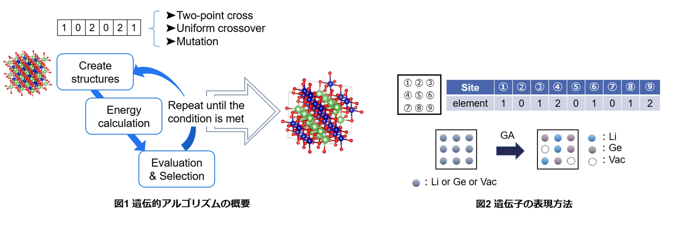

# Genetic Algolithm for mAterial (GmAte_ML.py)

無機構造の安定配列を探索するプログラム

著者：横山弓夏、小山翼、中山将伸（名古屋工業大学）
編集日：2025年2月13日

※このマニュアルは2025/2/13以前のバージョンに対応しています

## 目的
部分置換サイトを持つホスト構造において、原子配列を最適化するためのプログラムです。主に無機結晶材料を対象としています。
欠陥を含む化合物や非化学量論的化合物では、原子や欠陥の配置によって系の安定性が異なります。本プログラムは、遺伝的アルゴリズム（GA）を用いて、系の全エネルギーを低減することで最も安定な原子配列を探索します。
さらに、適切な入力を用意すれば、無機結晶固体材料以外の系にも適用可能です。また、最適化の対象となる物理量は、系のエネルギー以外の要素も設定できます。
無機構造の元素置換を評価する際には、どのサイトの原子を置換するかが重要となります。通常、最も安定な構造が選ばれますが、考えられる配置の組み合わせが膨大になるため、すべての可能性を計算することは計算コストの面で困難です。本スクリプトでは、最適化アルゴリズムの一種である遺伝的アルゴリズムを活用し、より少ない探索回数で最も安定な構造を見つけ出します。
  
  
## 技術的背景
本節では、遺伝的アルゴリズム（GA）を用いて部分占有サイトにおける原子配列を生成し、最も安定なエネルギー配置を探索するプロセスについて説明します。

図1は、遺伝的アルゴリズムのフローを示しています。遺伝的アルゴリズムでは、原子の配置を表す「染色体（chromosome）」を用いて最適化を進めます。図2に示すように、染色体は数値ラベル（0、1、2…）の配列で構成されており、各ラベルの数値はユーザーが指定した原子種を表し、その並び順はユーザーが指定したサイト番号に対応します。つまり、染色体を決定することで、特定の原子配置を持つ構造が定義されます。まず、ランダムに配置された複数の構造（初期世代）を生成し、それぞれのエネルギー値を評価します（図1の赤色部分）。GmAte_ML.py では、GAによって生成された構造のエネルギー評価を行うために外部ソフトウェアを必要とします（図1の赤色部分）。エネルギー的に安定な構造は「生存者」として選択されます。GmAte_ML.py には、（１）ランキング選択（Ranking-selection）、（２）トーナメント選択（Tournament-selection）、（３）ルーレット選択（Roulette-selection）の３つのアルゴリズムが実装されています。生存者（親）の染色体は、次の世代へ以下の4つのプロセスを通じて引き継がれます。

1) 最も安定な構造をそのまま継承する。
2) 二点交叉（Two-point crossover）により新たな染色体を生成する。
3) 一様交叉（Uniform crossover）により新たな染色体を生成する。
4) 突然変異（Mutation）により新たな染色体を生成する。

このようにして生成された新しい染色体（子孫個体）のエネルギーを外部ソフトウェアで評価し、新たな生存者を選択します。このルーチンを、ユーザーが設定した停止条件を満たすまで繰り返します。

現在のバージョンでは、エネルギー評価用のスクリプトとして[M3GNet.py](https://github.com/materialsvirtuallab/m3gnet)が含まれています。

**GAMLについて**
さらに、多くのGA遺伝子が存在する場合に収束に時間がかかるという問題を解決するために、本プログラムは「GAML」を実行することができます。GAMLは、選択プロセスに機械学習（ML）を組み込むことで、より少ない世代で最も安定した構造を発見することを目的としています。
GAMLでは、過去のGA世代で生成されたすべての構造を記述子（descriptors）に変換し、材料シミュレーションによって得られたエネルギー値を用いてML回帰分析を適用し、予測関数を作成します。この予測精度がユーザー設定の閾値を超えた場合、次世代に必要な個体数nよりも多くの個体を遺伝子操作によって生成します。そして、これらの余剰個体に対してMLによる予測評価を行い、予測された適応度（fitness）が高い候補を選択し、従来のGA手法で作成された個体と組み合わせて次世代の集団を形成します。さらに、世代ごとに予測関数を更新することで、GAの収束を逐次加速させることができます。

GAMLは、前述の4つのステップに加え、以下の2つのステップを含む6つのステップで構成されます。
5) 交叉を経た複数の遺伝子を生成し、機械学習による予測を行う
6) 突然変異を経た複数の遺伝子を生成し、機械学習による予測を行う

## 使用方法
**ファイルの準備**
1. 必要なファイル 
    * Specific  
        ├POSCAR_org  
        ├inp_POSCAR.py  
        ├optm3g.py (オプション：thread=True, runtype="m3g"のときに必要。M3Gnetによる計算をする際、importが一回で済む。)  
        └calc_energy.py (オプション：inp_POSCAR.py 内で thread=False の場合に使用。遺伝子からPOSCARを作成する場合にも使用可能。)     
    * inp_ga.py  
    * inp.params  
    * prepstrings.py 
    * SpccificML（オプション：inp_ga.py内で、mlga=Trueの場合に使用。GAMLを実行する場合のみ必要）
        ├ make_model.py（ランダムフォレストを使用して機械学習モデルを作成するコード）
        └ predML.py（機械学習モデルを用いて実際に予測を行うコード）

    inp_ga.py、inp.params、POSCAR_org、inp_POSCAR.pyを編集する必要があります。

2. POSCAR_orgの準備
    通常のPOSCARファイル（VASP用の構造フォーマット）を作成し、配列を最適化したいサイトのラベルをELEM1に変更します。
    ただし、最適化したいサイトが複数ある場合は、ELEM2, ELEM3,...とラベリングを行います。

3. inp_POSCAR.pyの準備
    

    Table1. inp_POSCAR.pyの入力パラメータの例
    
  
    
    | parametar | example | memo |
    |----|----|----| 
    | runtype | "m3g" | 遺伝的アルゴリズムから生成された構造体のエネルギー（または他のターゲット変数）を評価するコードを入力します。 例として、ニューラルネットワークポテンシャル、M3GNetを使用します。|
    | ions | ["Li", "Al", "O"] | 構成する全ての原子の元素記号（またはラベル）を文字列形式で入力してください。Pythonの配列形式を使用しています。 |
    | ELEM | [["Li", "Al"]] | 特定のサイト（ELEM1、ELEM2... サイト）に配置される候補元素記号を、Pythonのリスト形式で入力してください。形式は以下のようになります：[[ELEM1のイオン], [ELEM2のイオン], ...]  |
    | savefiles |  ["POSCAR", "CONTCAR", "temp_gene"] | 構造入力のファイル名、評価後の最適化された構造ファイル、遺伝子列の一時的な出力ファイル名を入力してください。 |
    | output | "energy" | 計算により吐き出されるenergyファイルの指定。このファイルを読み取ってエネルギー値を取得しています。| 
    | thread | True | 外部ファイルをimportして個々の評価計算を実行したい場合はTrueにしてください。Falseの場合、毎計算calc_energy.pyを起動します。 |  
    
    thread = Trueに設定することで、GAによって生成された個体の評価のために外部プログラムを起動する代わりに、Pythonの評価スキーム（現在はM3GNetのみ）をインポートします。これにより、Python のインポート回数を減らし、計算時間の短縮が期待できます。
   例）thread = True, runtype = m3g の場合：Specificディレクトリ内のoptm3g.pyファイルが読み込まれ、M3GNetによる構造緩和が行われます。
       thread = False の場合は、M3Gnetを実行する別のpythonファイルが必要です。この場合、計算のたびにモジュールがimportされることになるため、計算時間が長くなる可能性があります。

5. inp_ga.pyを編集  
    遺伝的アルゴリズムの条件を設定する  
    

    Table2. inp_ga.pyのパラメータ   
    
  
    
    | parametar | default | memo |
    |----|----|----| 
    | mlga | True | GAMLを実行する場合はTrueに設定 |
    | mlopt1 | 10 | 世代ごとの一様交叉の回数：機械学習による予測の回数（POPULATION * SURVIVAL_RATE - mlopt） |
    | mlopt2 | 10 | 世代ごとの二点交叉の回数 |
    | mlopt3 | 3 | 世代ごとの突然変異の回数 |
    | mlext1 | 200 | 機械学習による予測を行う際の二点交叉の候補遺伝子の数 |
    | mlext2 | 200 | 機械学習による予測を行う際の一様交叉の候補遺伝子の数 |
    | mlext3 | 200 | 機械学習による予測を行う際の突然変異の候補遺伝子の数 |
    | outMLpred | "sort_label.out" | エネルギーが減少する順に遺伝子が並べられたファイル名 |
    | outMLreg | "test_rmse.out" | 機械学習による予測後のRMSEが含まれるファイル名 |
    | dirML | "MLrun" | 機械学習による予測から得られたデータを保存するディレクトリ名 |
    | POPULATION | 24 | 1世代あたりの個体数 |
    | NUM_OF_STRINGS | 1 | 染色体の数（ELEM1 ～ ELEMnは、POSCAR_orgにおいてNUM_OF_STRINGS=nの場合に割り当てられる） |
    | MAX_GENERATION | 300 | 最大世代数 |
    | SAVE | 3 | 次世代に引きつぐ最優秀な個体の数 |
    | SURIVAL_RATE | 0.6 | 次世代に親として引き継ぐ個体数。これらの個体は次世代の子孫の親として使用されます。 |
    | CR_2PT_RATE | 0.4 | 2点交叉の割合|
    | CR_UNI_RATE | 0.4 | 一様交叉の割合 |
    | CR_UNI_PB | 0.5 | 一様交叉によって選択された染色体の成分（ベース）において、反転が許可される確率。 |
    | MUTATION_PB | 0.02 | 突然変異が発生する確率 |
    | STOP_CRITERIA | 100 | 停止条件。GmAte_ML.py は、最良の染色体が更新されないままSTOP_CRITERIA世代経過後に停止します。 |
    | RESTART | True | 計算を続きから再開したい場合はTrueにしてください。ただし、再開するにはout.value_indivファイルが必要です。最初の世代から開始したい場合はFalseに設定してください。 |
    | ELEMENT_FIX | True | 各要素数を固定したい場合はTrueにしてください。 |
    | temp_gene | "temp_gene" | |
    | eval_file | "energy" | エネルギー値を読み取るファイル名 |
    | ncore | 8 | 並行して実行される緩和計算の数 |
  
  
6. inp.paramsを作成  
    初期遺伝子を作成するファイル。どの元素が何個あるかを読み込むのに使用する。  
    1) prepstrnigs.pyを編集  
        0, 1, 2...遺伝子番号はinp_POSCAR.py内のELEMで設定した順番と対応  
    2) prepstrings.pyを実行  
        inp.parmasが作成される  

&nbsp; 
**◆構造緩和計算（評価プロセス）◆**    
* vaspを用いて行う場合  (https://www.vasp.at/)
  - inp_POSCAR.pyのパラメータを以下に設定  
      runtype = "vasp"  
      thread = False  
  - Specific内に以下のファイルを用意  
      KPOINTS, INCAR, POTCAR  
      POTCAR作成のためにPOSCARが必要な場合、inp.paramsをtemp_geneにコピーし「./calc_energy.py -gene2pos」を実行することでPOSCARを作成することができます。  

* M3GNetを用いて行う場合 (https://github.com/materialsvirtuallab/m3gnet )
  - inp_POSCAR.pyのパラメータを如何に設定  
    runtype = "m3g"  
    thread = True   
  - 「Specific」フォルダに「optm3g.py」をコピーしてください。

**◆GAの実行◆**  
* python GmAte_ML.py -ga  
    配列の最適化がスタートする。  
&nbsp;  
* python GmAte_ML.py -bestgene out.value_indiv (Arg1) (Arg2)  
    GA最適化が完了した後、GAで選択されたPOSCARファイルを、(Arg1)番目から(Arg2)番目まで抽出し、それぞれのPOSCARファイルがディレクトリに保存される。
&nbsp;  
* python calc_energy.py -gene2pos   
    temp_gene, POSCA_org, inp_POSCAR.pyがあるディレクトリで実行すると、temp_geneの中にある染色体（inp.params形式）を読み取ってPOSCARを作成する。
    Save_infoやout.value_indivに遺伝子配列は保存されています。 
&nbsp;      

## 生存個体選択方法について
GmAte_ML.py 38行目付近において生存個体の選択方法を指定することができます。   
select_mode = "ranking"  

* ランキング選択(ranking)  
    gstringと同様の選択方法。エネルギーの安定順に並べ、上位を生存個体とする。
* トーナメント選択(tournament)  
    トーナメント戦を行い、勝者を生存個体とする。
* ルーレット選択(roulett)  
    優秀順に重みを付けルーレットを回すことで生存個体を選択する。優秀な個体ほどルーレットで選ばれやすくなるように重みがつけられている。  
&nbsp;      

## Exampleについて    
* LSCF_M3GNet  
    La38Sr26Co13Fe51O192の(La, Sr)サイト、(Co, Fe)サイトについて最適化を行ったもの  
    calc_energy.pyでm3g.pyを起動させることで、M3GNetによる計算を行っています。
    ※現在、m3g.pyはGithubに載せていません。  
    La, Sr, Co, Feの数は固定しています。  
&nbsp;      
* LSCF_nofix_M3GNet  
    (La, Sr)64(Co, Fe)64O192の(La, Sr)サイト、(Co, Fe)サイトについて最適化を行ったもの  
    m3gnetを使用して計算を行っています。
    (La, Sr), (Co, Fe)の比率は固定していません。  
&nbsp;
* LiAlO2_import_M3GNet
    LiAlO2のカチオンサイトの最適化を行ったもの
    Specific/optm3g.pyを用いてM3GNetによる計算を行っています。
    importが一度で済むため計算速くなります。
&nbsp;
* LiCoO2_GAML
    LiCoO2のカチオンサイトをGAMLを用いて最適化を行ったもの
    ランダムフォレストを用いた機械学習予測によって、一部の遺伝子を導入している。
&nbsp;
* LaSrGa3O7_GAML
    La1.5Sr0.5Ga3O7.25のLa/SrサイトをGAMLを用いて最適化を行ったもの
    ランダムフォレストを用いた機械学習予測によって、一部の遺伝子を導入している。
      
    

## ライセンス、引用について (License, Citing)
**ライセンス(About License)**  
This software is released under the MIT License, see the LICENSE.  
**引用先(Citing)**  
M. Nakayama, K. Nishii, K. Watanabe, N. Tanibata, H. Takeda, T. Itoh, T. Asaka, "First-principles study of the morphology and surface structure of LaCoO3 and La0.5Sr0.5Fe0.5Co0.5O3 perovskites as air electrodes for solid oxide fuel cells", Sci. Technol. Adv. Mater.: Methods, 1, 24-33 (2021)  [DOI:10.1080/27660400.2021.1909871 ](https://doi.org/10.1080/27660400.2021.1909871)

## Funding
科研費  19H05815, 20H02436

    

