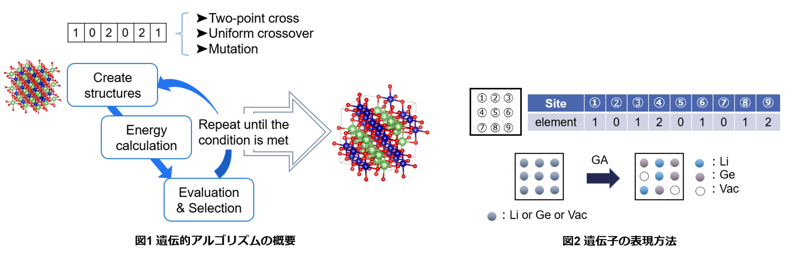

# Genetic Algolithm for mAterial (GmAte_ML.py)

無機構造の安定配列を探索するプログラム

著者：横山弓夏、小山翼、中山将伸（名古屋工業大学）
編集日：2026年5月24日

## 変更履歴
2024年8月   初版リリース 横山弓夏 (v1.0.0) <br>
2025年2月   GAML機能追加 小山翼、横山弓夏 (v2.0.0) <br>
2026年5月   calc_engineプラグインインターフェースの更新 (v2.1.0) <br>

## 目的
部分置換サイトを持つホスト構造において、原子配列を最適化するためのプログラムです。主に無機結晶材料を対象としています。
欠陥を含む化合物や非化学量論的化合物では、原子や欠陥の配置によって系の安定性が異なります。本プログラムは、遺伝的アルゴリズム（GA）を用いて、系の全エネルギーを低減することで最も安定な原子配列を探索します。
さらに、適切な入力を用意すれば、無機結晶固体材料以外の系にも適用可能です。また、最適化の対象となる物理量は、系のエネルギー以外の要素も設定できます。
無機構造の元素置換を評価する際には、どのサイトの原子を置換するかが重要となります。通常、最も安定な構造が選ばれますが、考えられる配置の組み合わせが膨大になるため、すべての可能性を計算することは計算コストの面で困難です。本スクリプトでは、最適化アルゴリズムの一種である遺伝的アルゴリズムを活用し、より少ない探索回数で最も安定な構造を見つけ出します。
  
  
## 技術的背景
本節では、遺伝的アルゴリズム（GA）を用いて部分占有サイトにおける原子配列を生成し、最も安定なエネルギー配置を探索するプロセスについて説明します。

図1は、遺伝的アルゴリズムのフローを示しています。遺伝的アルゴリズムでは、原子の配置を表す「染色体（chromosome）」を用いて最適化を進めます。図2に示すように、染色体は数値ラベル（0、1、2…）の配列で構成されており、各ラベルの数値はユーザーが指定した原子種を表し、その並び順はユーザーが指定したサイト番号に対応します。つまり、染色体を決定することで、特定の原子配置を持つ構造が定義されます。まず、ランダムに配置された複数の構造（初期世代）を生成し、それぞれのエネルギー値を評価します（図1の赤色部分）。GmAte_ML.py では、GAによって生成された構造のエネルギー評価を行うために外部ソフトウェアを必要とします（図1の赤色部分）。エネルギー的に安定な構造は「生存者」として選択されます。GmAte_ML.py には、（１）ランキング選択（Ranking-selection）、（２）トーナメント選択（Tournament-selection）、（３）ルーレット選択（Roulette-selection）の３つのアルゴリズムが実装されています。生存者（親）の染色体は、次の世代へ以下の4つのプロセスを通じて引き継がれます。

1) 最も安定な構造をそのまま継承する。
2) 二点交叉（Two-point crossover）により新たな染色体を生成する。
3) 一様交叉（Uniform crossover）により新たな染色体を生成する。
4) 突然変異（Mutation）により新たな染色体を生成する。

このようにして生成された新しい染色体（子孫個体）のエネルギーを外部ソフトウェアで評価し、新たな生存者を選択します。このルーチンを、ユーザーが設定した停止条件を満たすまで繰り返します。

現在のバージョンでは、エネルギー評価用のスクリプトとして[M3GNet.py](https://github.com/materialsvirtuallab/m3gnet)が含まれています。

**GAMLについて**
さらに、多くのGA遺伝子が存在する場合に収束に時間がかかるという問題を解決するために、本プログラムは「GAML」を実行することができます。GAMLは、選択プロセスに機械学習（ML）を組み込むことで、より少ない世代で最も安定した構造を発見することを目的としています。
GAMLでは、過去のGA世代で生成されたすべての構造を記述子（descriptors）に変換し、材料シミュレーションによって得られたエネルギー値を用いてML回帰分析を適用し、予測関数を作成します。この予測精度がユーザー設定の閾値を超えた場合、次世代に必要な個体数nよりも多くの個体を遺伝子操作によって生成します。そして、これらの余剰個体に対してMLによる予測評価を行い、予測された適応度（fitness）が高い候補を選択し、従来のGA手法で作成された個体と組み合わせて次世代の集団を形成します。さらに、世代ごとに予測関数を更新することで、GAの収束を逐次加速させることができます。

GAMLは、前述の4つのステップに加え、以下の2つのステップを含む6つのステップで構成されます。
5) 交叉を経た複数の遺伝子を生成し、機械学習による予測を行う
6) 突然変異を経た複数の遺伝子を生成し、機械学習による予測を行う

**GAML ML エンジン インターフェース** （`SpecificML/ml_engine.py`）

GmAte.py は中間ファイルを介さず、以下の2つの関数をメモリ内で呼び出します：

```python
# 現世代の評価済み個体からモデルを学習する
model, rmse = ml_engine.train(genes, energies)
# genes     : 遺伝子文字列リストのリスト [[str, ...], ...]
# energies  : 対応するエネルギー値のリスト
# 返り値    : (学習済みモデルオブジェクト, 交差検証 RMSE)

# 候補遺伝子をML予測値で昇順ソートしたインデックスを返す
sorted_indices = ml_engine.predict(model, candidate_genes)
# candidate_genes : 遺伝子文字列リストのリスト
# 返り値          : candidate_genes へのインデックスのリスト（予測値昇順）
```

デフォルトの `ml_engine.py` は、ASE で計算した RDF（動径分布関数）記述子を用いたランダムフォレスト回帰を使用します。異なるMLモデルや記述子を使いたい場合は、`SpecificML/ml_engine.py` をコピーして上記2関数を実装してください。




## ディレクトリ構成

```
GA-for-material/
├── GmAte.py
├── inp_ga.py
├── inp.params
├── Specific/               ← 計算エンジン固有ファイル一式
│   ├── inp_POSCAR.py       ← calc_engine のファイル名を指定
│   ├── calc_engine_mace.py ← ユーザーが用意（example/ からコピーして編集）
│   ├── POSCAR_org
│   ├── INCAR               ← VASP固有（必要な場合のみ）
│   ├── KPOINTS             ← VASP固有（必要な場合のみ）
│   └── POTCAR              ← VASP固有（必要な場合のみ）
└── example/
    ├── Specific_mace/      ← MACE テンプレート
    ├── Specific_vasp/      ← VASP テンプレート（INCAR・KPOINTS サンプル付き）
    ├── Specific_m3gnet/    ← M3GNet テンプレート
    ├── Specific_chgnet/    ← CHGNet テンプレート
    └── Specific_matlantis/ ← Matlantis/LightPFP テンプレート
```

## 使用方法
**ファイルの準備**
1. 必要なファイル
    * Specific/
        ├ POSCAR_org
        ├ inp_POSCAR.py
        └ calc_engine_***.py  ← **example/Specific_***/ からコピーして実装**
    * inp_ga.py
    * inp.params
    * prepstrings.py
    * SpecificML/（オプション：inp_ga.py で mlga=True の場合）
        └ ml_engine.py  ← 標準 ML インターフェース（train / predict をメモリ内で実行）

2. POSCAR_org の準備
    通常の POSCAR ファイル（VASP5 フォーマット）を作成し、最適化したいサイトのラベルを ELEM1 に変更します。
    複数のサイトグループを最適化する場合は ELEM2、ELEM3、... とラベリングします。

3. Specific/calc_engine_***.py の準備（計算エンジンプラグイン）

    GmAte.py は `Specific/inp_POSCAR.py` に指定されたエンジンファイルを動的に読み込み、個体ごとに以下を呼び出します：

    ```python
    score = calc_engine.run(work_dir)
    ```

    **標準インターフェース** — 実装が必要な関数はこれだけです：

    ```python
    def run(work_dir: str) -> float:
        """
        Parameters
        ----------
        work_dir : str
            個体の作業ディレクトリ（絶対パス）。
            GmAte は run() 呼び出し前にここへ以下のファイルを生成します：
              POSCAR    -- VASP5 形式の構造ファイル
              temp_gene -- 遺伝子文字列ファイル（フォーマットは下記）
        Returns
        -------
        float
            評価値（エネルギー等、小さいほど安定）
        """
    ```

    **temp_gene フォーマット** — calc_engine.py を書く際に必要な唯一の情報：

    ```
    # ELEM グループ数と同数の行（NUM_OF_STRINGS 行）
    # 各文字は整数インデックス（0, 1, 2, ...）で inp_POSCAR.py の ELEM に対応
    #
    # 例: ELEM = [["Li", "Al"]]
    #   temp_gene:  00110011
    #   サイト順:   Li Li Al Al Li Li Al Al
    #
    # 例: ELEM = [["Li", "Al"], ["Co", "Fe"]]
    #   temp_gene 1行目:  00110011   ← ELEM1（Li/Al サイト）
    #   temp_gene 2行目:  01010101   ← ELEM2（Co/Fe サイト）
    ```

    利用可能なテンプレート（`example/` フォルダ）：

    | テンプレートフォルダ | エンジン |
    |---|---|
    | `example/Specific_mace/` | MACE（ASE ベース汎用 NNP） |
    | `example/Specific_m3gnet/` | M3GNet（自己完結型、追加ファイル不要） |
    | `example/Specific_chgnet/` | CHGNet（Materials Project 汎用 NNP） |
    | `example/Specific_matlantis/` | Matlantis / LightPFP |
    | `example/Specific_vasp/` | VASP（第一原理計算、HPC クラスタ向け） |

4. Specific/inp_POSCAR.py の準備

    | パラメータ | 例 | 説明 |
    |---|---|---|
    | calc_engine | "calc_engine_mace.py" | Specific/ 内のエンジンファイル名 |
    | ions | ["Li", "Al", "O"] | 構造中の全元素記号 |
    | ELEM | [["Li", "Al"]] | ELEMグループごとの候補元素：[[ELEM1], [ELEM2], ...] |
    | savefiles | ["POSCAR", "CONTCAR", "temp_gene"] | 各評価後にアーカイブするファイル名 |
    | output | "energy" | エンジンが書き出すエネルギーファイル名（アーカイブ用） |

5. inp_ga.py の編集

    | パラメータ | デフォルト | 説明 |
    |---|---|---|
    | mlga | False | GAMLを使う場合はTrue |
    | save_ml_log | True | True: 学習RMSE（`test_rmse.out`）と選択遺伝子列（`sort_label.out`）を出力; False: メモリ内処理のみ |
    | POPULATION | 24 | 1世代あたりの個体数 |
    | NUM_OF_STRINGS | 1 | 染色体グループ数（ELEMグループ数と一致） |
    | MAX_GENERATION | 300 | 最大世代数 |
    | SAVE | 3 | エリート継承個体数 |
    | SURVIVAL_RATE | 0.6 | 生存率（次世代の親候補の割合） |
    | CR_2PT_RATE | 0.4 | 2点交叉の割合 |
    | CR_UNI_RATE | 0.4 | 一様交叉の割合 |
    | CR_UNI_PB | 0.5 | 一様交叉における反転確率 |
    | MUTATION_PB | 0.02 | 突然変異確率 |
    | STOP_CRITERIA | 100 | 最良値が更新されない世代数の上限 |
    | RESTART | False | True にすると out.value_indiv から再開 |
    | ELEMENT_FIX | True | True で元素数を固定（組成保存） |
    | select_mode | "ranking" | 生存者選択：ranking / tournament / roulet |
    | temp_gene | "temp_gene" | 遺伝子ファイル名 |
    | n_parallel | 6 | **同時並列計算プロセス数**。1プロセスあたりのリソース管理は calc_engine.py に委ねます。<br>• Python NNP（MACE・CHGNet）：run() 内で `torch.set_num_threads(1)` 推奨；n_parallel = CPU コア数（GPU あり：GPU 数）<br>• VASP 等外部バイナリ：n_parallel=1 推奨、並列化は MPI に委ねる<br>• HPC クラスタ：総コア数 = n_parallel × (1ジョブあたりコア数) |

6. inp.params の作成
    1) prepstrings.py を編集（インデックス 0, 1, 2, ... が ELEM 順に対応）
    2) `python prepstrings.py` を実行 → inp.params が生成される

&nbsp;
**◆クイックスタート：エンジンの接続◆**

* **MACE**
  ```
  cp example/Specific_mace/* Specific/
  # Specific/inp_POSCAR.py と calc_engine_mace.py を編集
  pip install mace-torch
  ```

* **CHGNet**
  ```
  cp example/Specific_chgnet/* Specific/
  pip install chgnet
  ```

* **M3GNet**（自己完結型、optm3g.py 不要）
  ```
  cp example/Specific_m3gnet/* Specific/
  pip install matgl          # 推奨（新バージョン）
  # または: pip install m3gnet   # レガシー
  ```

* **VASP**
  ```
  cp example/Specific_vasp/* Specific/
  # POTCAR を Specific/ に配置、calc_engine_vasp.py の VASP_CMD を編集
  ```

* **Matlantis / LightPFP**
  ```
  cp example/Specific_matlantis/* Specific/
  # inp_ga.py で n_parallel = 1 に設定
  pip install pfp-api-client matlantis-pfp
  ```

**◆GAの実行◆**  
* python GmAte_ML.py -ga  
    配列の最適化がスタートする。  
&nbsp;  
* python GmAte_ML.py -bestgene out.value_indiv (Arg1) (Arg2)  
    GA最適化が完了した後、GAで選択されたPOSCARファイルを、(Arg1)番目から(Arg2)番目まで抽出し、それぞれのPOSCARファイルがディレクトリに保存される。
&nbsp;  

## ライセンス、引用について (License, Citing)
**ライセンス(About License)**  
This software is released under the MIT License, see the LICENSE.  
**引用先(Citing)**  
1. M. Nakayama, K. Nishii, K. Watanabe, N. Tanibata, H. Takeda, T. Itoh, T. Asaka, "First-principles study of the morphology and surface structure of LaCoO3 and La0.5Sr0.5Fe0.5Co0.5O3 perovskites as air electrodes for solid oxide fuel cells", Sci. Technol. Adv. Mater.: Methods, 1, 24-33 (2021)  [DOI:10.1080/27660400.2021.1909871 ](https://doi.org/10.1080/27660400.2021.1909871)<BR>
2. Tsubasa Koyama, Yumika Yokoyama, Naoto Tanibata, Hayami Takeda, Masanobu Nakayama, "Efficient Optimization of Atom/Ion Arrangements in Crystalline Solids Using Genetic Algorithms and Machine-Learning Regression", J. Ceram. Soc. Jpn. in press (2025), https://doi.org/10.2109/jcersj2.25006<BR>

## Funding
科研費  19H05815, 20H02436


    

